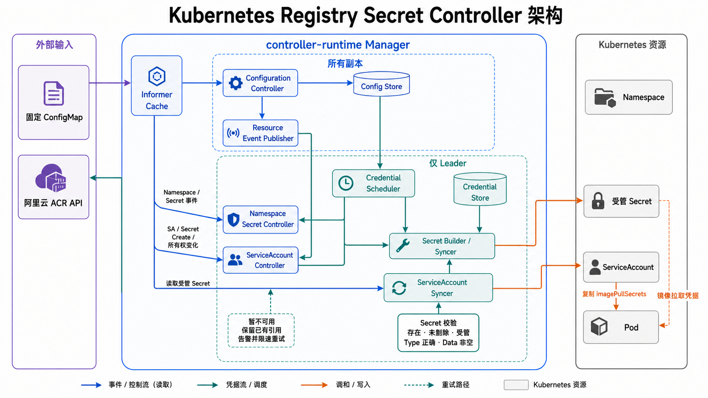

# Controller 架构与核心时序

本文用架构图和文字描述项目的核心组件及三条主要调用链。ServiceAccount 在首次新增
固定引用前校验受管 Secret 是否存在且具有最小合法结构；Token 轮换和 Secret 原地
更新继续使用同一个稳定引用。实现边界见
[ServiceAccount Patch 前的受管 Secret 校验](./serviceaccount-secret-validation.md)。

## 组件关系

`Config Store` 保存每个进程最后一次有效配置，`Credential Store` 保存 Leader
进程当前取得的临时凭证。两个资源 Controller 不直接调用彼此，而是通过 Kubernetes
Secret 及其 Watch 事件协作。

## 用户创建 ServiceAccount

1. ServiceAccount Create/Update 事件把 `namespace/name` 放入 SA Controller 队列。
2. Syncer 读取最新配置，并通过 Manager Cache 读取同 Namespace 的固定名称 Secret。
3. Secret 存在、未删除、受管且结构完整时，使用 optimistic-lock Patch 确保固定引用
   恰好存在一次。
4. Secret 不存在、正在删除或结构不完整时，不新增也不移除固定引用，返回可重试错误；
   Secret Create 事件会立即唤醒等待对象，限速队列负责兜底。
5. 同名 Secret 不受管时不新增引用，并清理可能遗留的固定引用；所有权冲突由
   Namespace Secret Controller 集中告警。

Patch 前读取走 Manager Cache，不会为每个 ServiceAccount 调用 ACR。大量创建时的
主要成本是逐个写入 ServiceAccount，而不是 Secret 状态判断。

## 用户修改 ConfigMap

1. Configuration Controller 从 Cache 读取固定 ConfigMap。无效配置只记录错误并保留
   最后一份有效快照。
2. 有效配置原子写入 Config Store，并通知 Credential Scheduler 和 Resource Event
   Publisher。
3. Namespace Secret Controller、ServiceAccount Controller 和凭证调度并行收敛：前者
   渲染固定 Secret，后者重新匹配 SA，Scheduler 只为新增 Registry 或 AK/SK 变化立即
   取证。
4. Secret 始终使用固定名称；配置收敛期间，暂时不可用不会导致已有 SA 引用抖动。

Domain 或 Namespace/ServiceAccount 选择变化可以复用现有 Token；Registry 新增或
AK/SK 变化才需要立即重新调用 ACR。

## Token 临近过期

1. Credential Queue 在 `expiresAt - 5m` 唤醒对应 RegistryKey，Worker 使用 15 秒超时
   调用 ACR。
2. 获取成功且配置未变化时，Credential Store 原子替换凭证，并将全部目标 Namespace
   入队更新固定 Secret。
3. Secret 内容 Update 由 informer 同步到 Cache，但普通 Token/Data Update 不扇出
   ServiceAccount，因为固定引用不绑定 Token 版本。
4. ACR 失败时按 5～60 秒退避重试并继续保留旧 Secret 和 SA 引用；旧 Token 最终过期
   也不会触发引用摘除。

当前已经实现提前五分钟刷新、调用超时和失败退避；“刷新持续失败直至旧 Token
过期”后的业务级 Event 和 Metrics 仍属于待实现范围，但不需要改变 ServiceAccount
引用。
