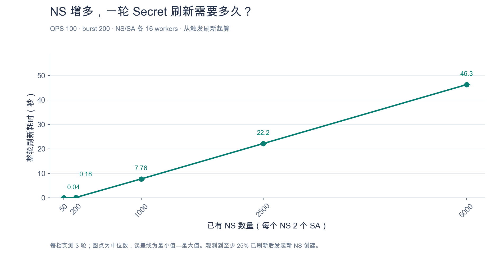
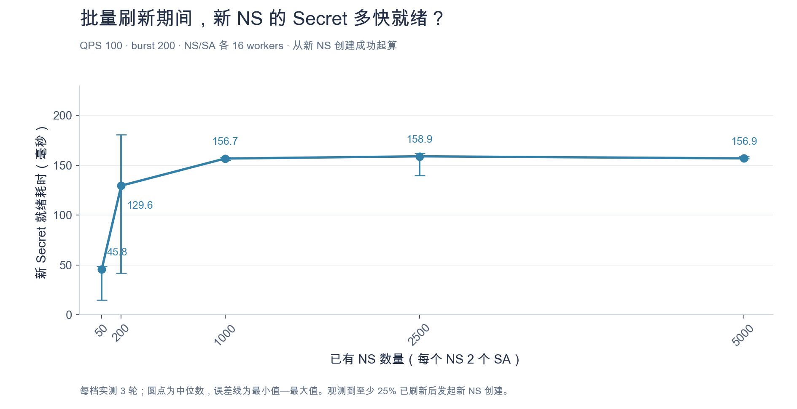
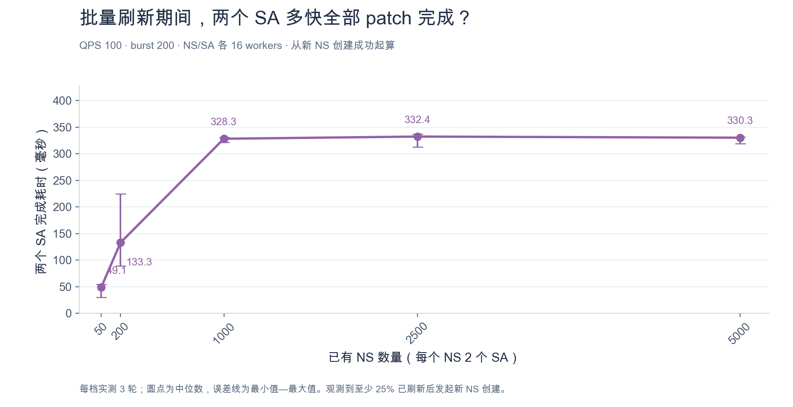

# 从 29 秒到 0.35 秒：重构我在阿云负责的组件

项目地址：[GitHub 仓库](https://github.com/RyanWang945/kubernetes-registry-secret-controller)。

## 1. 引言

在阿里云的三年，我独立负责过一个组件，但并没有把它做到尽善尽美。

现在有了 AI 加持，我重新思考了组件的功能与限制，完成了一次重构和面向生产场景的压测。其中有几个性能优化点还不错，这篇 blog 就是来讲这个的。

## 2. 背景信息

这个组件的功能是比较明确的：

组件监听 CM 配置，获取临时凭证，在目标 NS 创建 Secret，再把 Secret 名字 patch 到 SA 上。

旧实现有几个问题：

1. 每 5 分钟检查一遍 Secret，过期了就更新。这个设计比较粗糙，当然不是我设计的，是某个 8 在 201 几年设计的。凭证明明有过期时间，却需要不断扫描才能决定刷新。
2. SA 和 NS 创建事件全部汇总成 NS 事件。新建一个 SA，也要重新检查整个 NS 的 Secret 和 SA。多个 SA 连续创建，就容易形成事件风暴。
3. 刷新和新资源处理共用 client 请求预算，处理路径又混在一起。上千个 Secret 同时刷新，新 NS 就排在后面。等到 Secret 创建和 SA patch 完成，Pod 都开始拉镜像了，已经完犊子了。
4. Helm 同时创建 SA 和 Pod，还存在竞态。Pod 创建时没拿到 SA 上的 Secret 引用，之后补 patch SA，也不会自动更新已有 Pod。这个当时用 webhook 解决。

## 3. 这次重构中比较好的点

### 3.1. 删除定时扫描，引入延迟队列

下一次准确刷新时间可以通过**凭证过期时间减去提前刷新窗口**直接计算出来。

延迟队列的核心就是定时器和最小堆，按执行时间排列任务，到点再处理。我直接使用 client-go 的实现，以 registry 为调度粒度。延迟队列这个后续新开一篇，这个蛮有趣的。

一个 registry 的镜像被 1000 个 NS 使用，只需要围绕这份凭证安排刷新。到期前获取新 token，再通知各个 NS 更新 Secret。

1000 份 Secret 仍然需要写入，但重复的过期扫描可以删掉了。

### 3.2. 新建的 NS 和 SA 优先级设为 100

后台刷新存量 secret 有提前量（默认过期前 5 分钟刷新），但是新创建 ns 和 sa 大概率马上就要用。这个区别必须体现在排队顺序上。

所以，我在运行期间新建的 NS、SA 事件设置了 100 的优先级，后台刷新保持默认优先级。启动时加载的已有资源仍保留低优先级。

worker 完成当前任务后，就可以先处理新业务。优先级影响队列顺序，已经发出的请求和 client 限流仍然要等。

### 3.3. Controller 解耦，通过资源状态协作

NS controller 负责维护 Secret；SA controller 负责 patch 单个 SA。各自排队、各自重试，新建一个 SA 不再扩大成整个 NS 的检查。

如果 SA 先处理，但 Secret 还没准备好，就稍后重试。Secret 创建成功的事件，也会主动唤醒对应 SA 的处理。

还有一个细节：token 刷新只改变 Secret 内容，名字不变，所以不需要再 patch 一遍 SA。这能省掉大量无意义的联动。

### 3.4. 取证与分发分离

一次 registry 鉴权获取的 token，供多个 NS 复用。

取证失败，由调度器重试；某个 NS 写入失败，只重试这个 NS，不必重新鉴权。其他 NS 可以继续推进。如果只是分发通知失败，也能复用已经拿到的 token。

### 3.5. 把容易出问题的细节补齐

配置先校验，再整体替换快照；改错了就保留最后一份有效配置。只改限流参数，不触发全量资源处理。

SA patch 使用乐观锁，冲突后重新读取，避免覆盖别人同时添加的引用。资源没变化就不写，不归组件管理的 Secret 不强行覆盖。

QPS、burst 支持热更新，worker 数量修改需要重启。日志和 metrics 区分取证、分发、冲突和过期，方便定位问题。

## 4. 压测

环境是 Mac mini M4，三台 2C、2GB VM 搭建的三节点 K3s。规模测试覆盖到 5000 个 NS、10000 个目标 SA。

在未引入优先级时，1000 个 Secret 刷新约需 36 秒，期间新建 NS 要等约 **29** 秒，加优先级后降到约 **0.35** 秒。

压测也暴露了限制：QPS 为 5 时，5000 个 Secret 刷新用了约 16 分钟。只提前 5 分钟刷新，显然来不及。提前量必须覆盖取证、完整分发和失败重试。因此引入了 k8sclient 的 qps、burst 的热更新。
这些问题之前在生产中均遇到哟，这次重构做的完善了点。

值得注意的是，0.35 秒是资源准备时间并未完全解决 helm chart 下发时的 pod 和 sa 同时创建的问题。

### 4.1. 固定参数，把 NS 数量继续往上加

这次固定 QPS=100、burst=200，NS 和 SA controller 各 16 个 worker。每个 NS 两个 SA，NS 从 50 加到 5000，每档跑三轮，图里取中位数。

5000 份 Secret 刷新约 46.31 秒。刷新期间再新建一个 NS，也是两个 SA，Secret 约 0.157 秒就绪，两个 SA 约 0.330 秒全部 patch 完成。这两个时间都从 NS 创建成功起算。

这轮 VM 内存实际是 4/3/3 GiB，鉴权和调度时钟用了 mock，K8s 资源操作实跑。[实验口径与原始数据](benchmarks/2026-09-06/methodology.md)单独放了一份。

## 5. 总结

现代的 controller-runtime 脚手架已经比较完善了，感觉写起来比较简单，ai 加上了就更简单了。但是细节的工程化打磨非常关键，5000个 ns、10000 个 sa 的问题和 10个 ns 的简单验证概念完全不一样。
